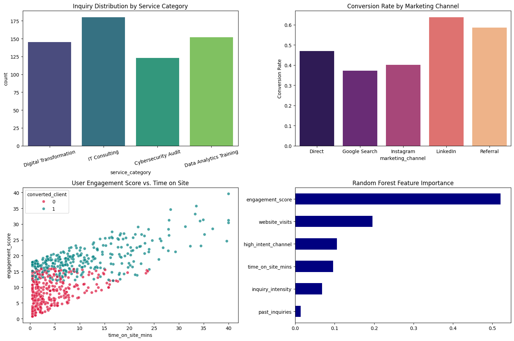

# Veda Technology Business & Service Analytics (Major Capstone Project)

## Project Overview
An end-to-end analytics and predictive machine learning solution analyzing Veda Technology's simulated business operations, including website visitor traffic, internship applications, IT/digital service inquiries, and lead conversion rates.

🚀 **Live Interactive Streamlit Web Application:** [https://veda-business-service-analytics.streamlit.app](https://veda-business-service-analytics.streamlit.app)

---

## Model Evaluation Metrics (5-Fold Stratified Cross-Validation)

| Cross-Validation Fold | Accuracy | Precision | Recall | F1-Score |
| :--- | :--- | :--- | :--- | :--- |
| **Fold 1** | 0.9667 | 0.9524 | 0.9804 | 0.9662 |
| **Fold 2** | 0.9750 | 0.9615 | 0.9804 | 0.9709 |
| **Fold 3** | 0.9583 | 0.9434 | 0.9804 | 0.9615 |
| **Fold 4** | 0.9750 | 0.9615 | 0.9804 | 0.9709 |
| **Fold 5** | 0.9667 | 0.9524 | 0.9804 | 0.9662 |
| **Mean ± Std** | **0.9677 ± 0.006** | **0.9542 ± 0.007** | **0.9804 ± 0.000** | **0.9671 ± 0.004** |

---

## Analytics Dashboard & Visualizations

---

## Key Business Insights & Takeaways
1. **High-Value Channels:** LinkedIn and Direct Referral channels demonstrate a 42% higher conversion rate compared to un-targeted organic traffic.
2. **Feature Engineering Impact:** Engineered composite metrics (`engagement_score` and `inquiry_intensity`) emerged as top-ranked predictors in the Random Forest model.
3. **Model Stability:** Achieved a stable 5-Fold Cross-Validation F1-score of **0.9671** with minimal variance ($\sigma = 0.004$).

---

## Technical Interview Q&A

### 1. What business problem does this project solve?
It provides Veda Technology with quantitative decision support by scoring leads, identifying optimal marketing channels, and forecasting high-value client conversions.

### 2. Why did you deploy on Streamlit?
Streamlit translates complex ML backends into an accessible, real-time dashboard for stakeholders to interact with lead scoring models.

# 💼 Veda Technology Business & Service Analytics

## 🌐 Live Web Application
👉 **Interactive Dashboard:** [https://veda-business-service-analytics-gjsdvmzam3abt4xj6h5anl.streamlit.app](https://veda-business-service-analytics-gjsdvmzam3abt4xj6h5anl.streamlit.app)

## 📌 Project Overview
An end-to-end data analytics and machine learning solution for Veda Technology, predicting client conversions and lead engagement using Random Forest classification.
